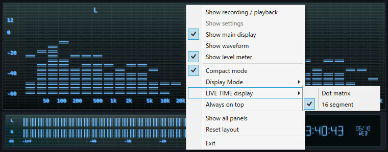

# Spectrum Viewer RT

[English](README.md)

Spectrum Viewer RTは、パソコンで再生している音やマイクの音を、スペクトログラム、スペクトラムアナライザー、波形、レベルメーターでリアルタイムに眺められるWindowsアプリです。

レトロなオーディオ機器の蛍光表示管（VFD）をイメージした外観で、音楽鑑賞時のビジュアライザー、音声の確認、録音などに利用できます。

画像を音声化したサンプルの表示例（音声生成: [imagetoaudio](https://nsspot.herokuapp.com/imagetoaudio/)）

## このアプリでできること

### パソコンやマイクの音をリアルタイムに見る

Windowsで再生中の音、または接続したマイクの音を表示できます。

- 音の時間変化を色で確認できるスペクトログラム
- 周波数ごとの音量を確認できるモノラル／ステレオのスペクトラムアナライザー
- 音声波形と左右のレベルメーター
- LIVE経過時間と時計表示
- 音声デバイスの接続・切断に応じた入力デバイス一覧の自動更新

曲の帯域バランスを眺めたり、左右チャンネルの違いや入力レベルを確認したりできます。

### レトロなオーディオ機器風の表示を楽しむ

蛍光表示管（VFD）をイメージした色、発光、薄暗く残る非点灯部分、表示パターンを選べます。

ブロック表示、細線表示、ドットマトリクス表示に切り替えられるため、昔のオーディオ機器や測定器のような雰囲気を好みに合わせて楽しめます。

### 音声を録音して保存する

表示中の音声を録音し、アプリ内で再生できます。再生位置を移動して確認したあと、WAVファイルとして保存できます。

パソコンの再生音を録音した場合は、左右のチャンネルを保持したステレオWAVとして保存されます。

### 必要な表示だけを残して小さく使う

右クリックメニューから、メイン表示、波形、レベルメーター、録音操作などを個別に表示・非表示にできます。

Compactモードでは設定部分やタイトルバーを隠し、デスクトップの隅にレベルメーターだけを置くような使い方もできます。通常表示とCompact表示は、それぞれ最後に使ったパネル構成を記憶します。

## ダウンロードと起動

### 1. アプリをダウンロードする

1. [最新版のダウンロードページ](https://github.com/kn86elt/SpectrumViewerRT/releases/latest)を開きます。
2. ページ下部の「Assets」を開きます。
3. `SpectrumViewerRT-vX.Y.Z-win-x64.zip`という名前のファイルをクリックしてダウンロードします。

`Source code`と書かれたファイルではなく、名前に`win-x64`が含まれるZIPファイルを選んでください。

### 2. ZIPファイルを展開する

1. ダウンロードしたZIPファイルを右クリックします。
2. 「すべて展開」を選びます。
3. 展開先を確認して「展開」を押します。

ZIPファイルの中から直接起動せず、必ず先に展開してください。

### 3. アプリを起動する

展開したフォルダー内の`SpectrumViewerRT.exe`をダブルクリックします。

起動しない場合は、[.NET 6 Desktop Runtime（Windows x64）](https://dotnet.microsoft.com/ja-jp/download/dotnet/6.0)をインストールしてから、もう一度起動してください。

このアプリにはデジタル署名がないため、Windowsの警告が表示される場合があります。信頼できる配布元からダウンロードしたことを確認したうえで、「詳細情報」から実行できます。

## 基本的な使い方

1. `Source`で音の入力元を選びます。
   - `System Output`: パソコンで再生している音
   - `Audio Input`: 選択した入力デバイスから入る音
2. `Display`で見たい表示を選びます。
   - `Spectrogram`
   - `Spectrum Analyzer (Mono)`
   - `Spectrum Analyzer (Stereo)`
3. 録音する場合は`Record`を押し、終了時に`Stop`を押します。
4. 録音後は`Play`で確認し、`Save WAV`で保存します。

画面上で右クリックすると、表示するパネル、Compactモード、表示モード、常に手前に表示する設定などを変更できます。

右クリックメニューからVFDのColorとMeterスタイルを直接選択することもできます。

レベルメーター右側のLIVE TIME表示をクリックすると、経過時間と時計表示を切り替えられます。Compactモードでは、この部分をドラッグしてウインドウを移動することもできます。

## ショートカットキー

| ショートカット | 動作 |
|---|---|
| `Ctrl+1` | Recording / Playback操作部の表示切り替え |
| `Ctrl+2` | Settingsの表示切り替え |
| `Ctrl+3` | メイン表示の表示切り替え |
| `Ctrl+4` | 波形の表示切り替え |
| `Ctrl+5` | レベルメーターの表示切り替え |
| `Ctrl+T` | Compactモードの切り替え |
| `Ctrl+D` | Spectrogram、Analyzer Mono、Analyzer Stereoを順次切り替え |
| `Ctrl+L` | LIVE TIME表示のDot Matrix／16SEG切り替え |
| `Ctrl+F` | Cyan、Green、Amber、Blueを順次切り替え |
| `Ctrl+M` | Block、Fine Lines、Dot Matrix Block、Dot Matrix Fine Linesを順次切り替え |

## 設定について

選択した表示、色、パネル構成、ウインドウモードなどは自動的に保存され、次回起動時に復元されます。

設定を初期状態へ戻したい場合は、アプリの`Default Settings`を使用してください。

## 動作環境

- Windows 10／11（64ビット）
- .NET 6 Desktop Runtime

## ライセンス

このリポジトリのコードはMIT Licenseで提供されています。
