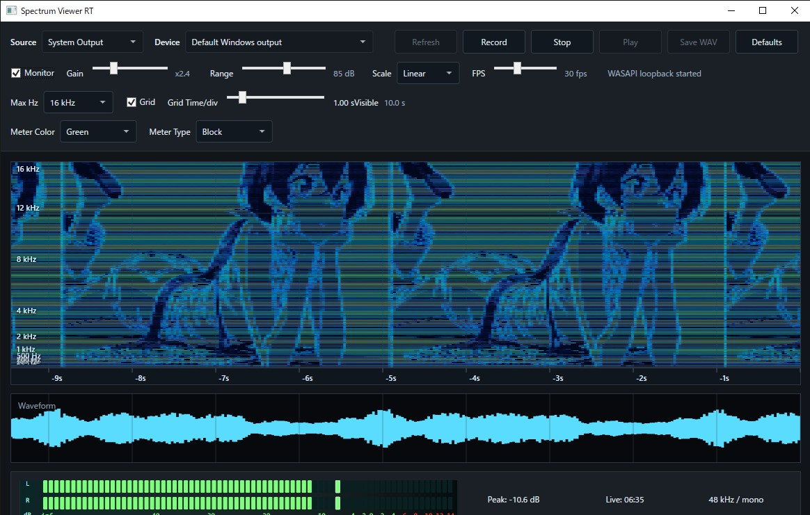
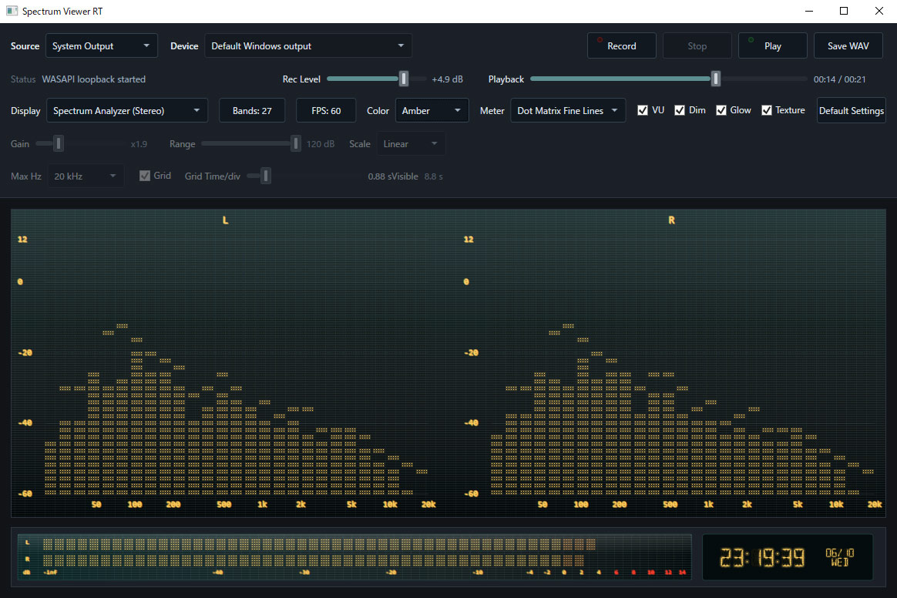

# Spectrum Viewer RT

[English](README.md)

Spectrum Viewer RTは、リアルタイムの音声モニタリング、録音、再生、WAV書き出し、およびVFDをイメージした音声表示を行うWindowsデスクトップアプリケーションです。



スペクトログラムモード  
音声生成: [imagetoaudio](https://nsspot.herokuapp.com/imagetoaudio/)



スペクトラムアナライザーモード

## 主な機能

- マイク入力およびWASAPIループバックによるWindows標準出力のキャプチャ
- 音源・入力デバイスを切り替え可能な常時ライブモニタリング
- リアルタイムのスクロール式スペクトログラム・波形表示
- Spectrogram、Spectrum Analyzer (Mono)、Spectrum Analyzer (Stereo)の3表示モード
- スペクトログラム／スペクトラムアナライザーの両モードで使用できる波形表示
- リニア／対数周波数スケールと最大表示周波数の選択
- 周波数・時間グリッドの表示切り替えと時間軸間隔の調整
- ピークホールド付きVFD風ステレオレベルメーター
- アナログ機器風の表示を行うVUノーマライズ
- VFDカラー、ブロック／細線スタイル、非点灯セグメント、Glow、表示テクスチャの設定
- ドットマトリクス／16セグメントを選択できるLIVE・REC・PLAY時間表示
- リアルタイム録音、シーク対応再生、WAV書き出し
- System Output録音のステレオWAV書き出し
- 48 kHz／16-bitの処理系
- 録音レベルと、Spectrogram用のゲイン、ダイナミックレンジ、スケール、周波数上限、時間グリッドの調整
- 15／30／60 FPSプリセットと、Slider・数値入力によるFPS詳細調整
- 通常表示とCompact表示
- 録音再生、設定、メイン表示、波形、レベルメーターの個別表示切り替え
- 通常表示とCompact表示で独立したパネル表示状態の保存
- タイトルバーを省いたCompact表示
- 通常表示・Compact表示共通の右クリックメニュー操作
- ウインドウサイズに追従するパネル・VFD表示
- 常に手前に表示するオプション
- `%AppData%\SpectrumViewerRT\settings.json`への設定保存

## 動作環境

- Windows x64
- [.NET 6 Desktop Runtime](https://dotnet.microsoft.com/ja-jp/download/dotnet/6.0)

## 実行方法

### Release zip

`SpectrumViewerRT-vX.Y.Z-win-x64.zip`をダウンロードして展開し、次のファイルを実行します。

```powershell
.\SpectrumViewerRT.exe
```

配布アーカイブはフレームワーク依存形式です。起動しない場合はWindows x64用の.NET 6 Desktop Runtimeをインストールしてください。

### ソースコードから実行

```powershell
dotnet run
```

ローカルでReleaseビルドを発行する場合:

```powershell
dotnet publish -c Release
.\bin\Release\net6.0-windows\publish\SpectrumViewerRT.exe
```

## 基本操作

1. `Source`から`Microphone`または`System Output`を選択します。
2. `Microphone`使用時は`Device`から入力デバイスを選択します。
3. `Rec Level`で録音信号とライブ入力表示のレベルを調整します。
4. `Display`から`Spectrogram`、`Spectrum Analyzer (Mono)`、`Spectrum Analyzer (Stereo)`のいずれかを選択します。
5. `Record`で録音を開始し、`Stop`でライブモニタリングへ戻ります。
6. 録音後は`Play`、シークバー、`Save WAV`を利用できます。

`Scale`、`Max Hz`、`Display`を変更すると、表示履歴がクリアされ新しい設定で描画を開始します。`Range`の変更では既存の表示履歴を消去せず、以降のスペクトログラム描画へ反映するため、設定による変化を比較しやすくなっています。波形表示はスペクトログラムと同じ時間軸を使用します。`Grid Time/div`は横方向の時間間隔を指定し、表示範囲は10目盛り分です。

`Gain`はFFTおよび画面表示の強度を調整し、録音音声には影響しません。`Range`はスペクトログラムのダイナミックレンジ、`FPS`は描画更新頻度を設定します。

Spectrogram専用設定はDisplay段の下に配置され、Spectrum Analyzer表示中は無効になります。Analyzerは20 kHz固定で動作し、Spectrogram用のGainおよびMax Hz設定を参照しません。

`FPS`ボタンから15、30、60 FPSのプリセットを選択できます。`Detailed settings...`では12～60 FPSの範囲をSliderと数値入力で調整でき、変更は動作中の表示へ即時反映されます。

`VU`はレベルメーターとスペクトラムアナライザーの表示だけを増幅し、公称レベルがアナログ録音機器のように0 dB付近へ届く表示にします。録音・書き出し音声には影響しません。

`Spectrum Analyzer (Stereo)`では、ステレオサンプルを利用できる場合に左右を分離したアナライザーを表示します。

各設定コントロールをダブルクリックすると個別の初期値へ戻せます。`Default Settings`では表示、メーター、グリッド、ウインドウ設定をまとめて初期化します。

## ウインドウとパネル

アプリケーション背景の右クリックメニューから、次のパネルを個別に表示・非表示にできます。

- 録音・再生操作
- 設定
- メインディスプレイ
- 波形
- レベルメーター

通常表示・Compact表示ともに従来型のメニューバーは表示せず、レイアウトやウインドウ操作は右クリックメニューから行います。Compact表示では設定パネルと標準タイトルバーも非表示にし、操作部品のない本体領域をドラッグしてウインドウを移動できます。

通常表示とCompact表示では、パネルの表示状態をそれぞれ独立して保存します。たとえば通常表示では全パネルを表示し、Compact表示ではレベルメーターだけを表示する使い方ができます。

ウインドウの拡大・縮小に合わせて表示中のパネルも調整されます。縦方向に余裕がある場合は、解像度が必要なメインディスプレイへ優先的に領域を割り当てます。レベルメーターなどの補助パネルは実用的な高さを上限とします。

## 音声キャプチャについて

`System Output`では、WASAPIループバックを使用してWindowsの標準再生デバイスをキャプチャします。録音データは48 kHz／16-bitのステレオWAVとして書き出されます。

マイク録音は現在モノラルのキャプチャ経路を使用します。

## ライセンス

このリポジトリのコードはMIT Licenseで提供されます。
